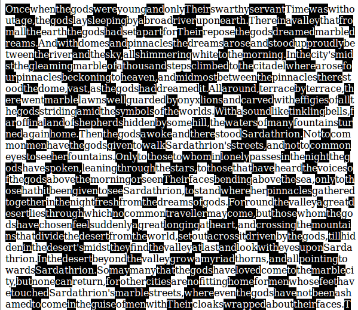

checkerboard-layout
===================

Requirements
------------

*   Python 2.7.6 (probably works with older versions too)
*   An input text
*   A modern web browser (to see the result)

Basic Strategy
--------------

*   Display each alternating word on a background of an alternating
    colour.  This allows us to remove intervening spaces and still
    claim that the result is readable.

Sample Output
-------------

Here is a screenshot of Firefox 33.0 displaying something by Lord Dunsany
that was passed through this script:

