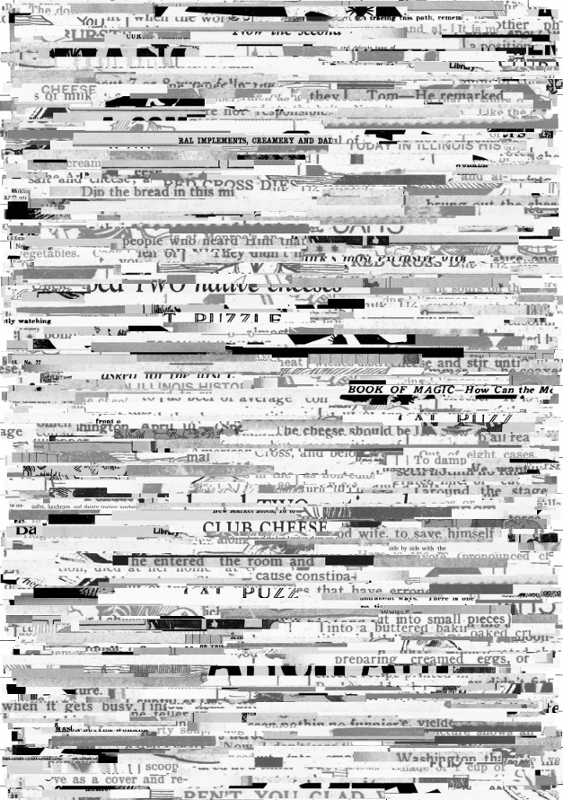

narrow-cut-up
=============

Hypothesis
----------

We hypothesize that we can do better than [naive-cut-up](../naive-cut-up).

Apparatus
---------

*   Python 2.7.6 (probably works with older versions too)
*   [Pillow](http://python-pillow.github.io/) (it might work with PIL too)
*   Some scanned images of newspapers, books, etc.

Method
------

*   Like [naive-cut-up](../naive-cut-up), except that it:
    *   scales each image to the size of the base ("canvas") image
    *   cuts and pastes in narrow strips instead of 1/9-page chunks

### Usage ###

In this example, we use images already obtained used by [naive-cut-up](../naive-cut-up)
[fetch-chronam](../fetch-chronam) and sorted as described in 

    $ ./narrow-cut-up.py ca_5.jp2.png pages/*

There are also some command-line options which are not yet documented.

Observations
------------

The result has promise, but looks like it might work best with pages
which contain more text than images.

