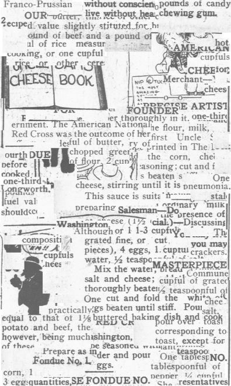

sensible-paste-up
=================

Hypothesis
----------

We hypothesize that the hard part about doing a good cut-up is not the cutting
so much as the pasting.

Apparatus
---------

*   Python 2.7.6 (probably works with older versions too)
*   [Pillow](http://python-pillow.github.io/) (it might work with PIL too)
*   Some images, possibly ones that have already been cut up by
    [find-cut-up-regions](../find-cut-up-regions), but any images should work
    (maybe)

Method
------

*   Read in all the cut-up images for their metadata.
*   Make a blank canvas, that is, totally 100% white pixels (and it is
    best maybe if pixels of this colour do not appear in the cut-up images.)
*   Start with the largest cut-up image.  Put it in the centre of the canvas.
*   Work downwards in size of image.  Try to put them as close to the centre
    of the canvas as possible, but also cover as many 100% white pixels as
    possible.
*   Continue until you have run out of white pixels or cut-up images.

Observations
------------

A bit disappointing, but then, this is a bit ambitious.  Could use more
than the split-attention few days I've been working on it, to get better
results.

The idea is to use bits that have been cut up with [find-cut-up-regions](../find-cut-up-regions).
The problem (if this is a problem) is that we either don't cover the
canvas, leaving areas full-white and ugly, or we run out of space, and
have wasted snippets.

But it's not terrible:

